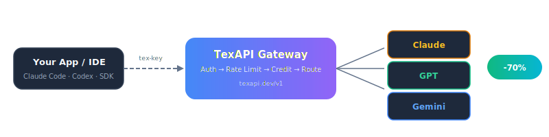

<p align="center">
  
</p>

<h1 align="center">TexAPI</h1>

<p align="center">
  <strong>One API key. All AI models. Up to 70% cheaper.</strong>
</p>

<p align="center">
  Access Claude, GPT, Gemini, and free models through a single OpenAI-compatible endpoint.<br/>
  Drop-in replacement for Anthropic, OpenAI, and Google APIs.
</p>

<p align="center">
  <a href="https://texapi.dev"></a>
  <a href="https://discord.gg/texapi"></a>
  <a href="#pricing"></a>
  <a href="./README.vi.md"></a>
</p>

<br/>

<p align="center">
  
</p>

---

## Getting Started

```bash
# That's it. Use any OpenAI-compatible SDK or tool.
curl https://texapi.dev/v1/chat/completions \
  -H "Authorization: Bearer tex-YOUR_API_KEY" \
  -H "Content-Type: application/json" \
  -d '{"model": "claude-sonnet-4-5", "messages": [{"role": "user", "content": "Hello!"}]}'
```

1. **Sign up** → [texapi.dev](https://texapi.dev) (Google / GitHub / Discord). Get 2 free credits.
2. **Create API key** → Dashboard → API Keys → Create.
3. **Use anywhere** → Set base URL to `https://texapi.dev/v1` in any OpenAI-compatible tool.

---

## Works With Everything

<table>
<tr>
<td width="50%">

### Claude Code

```bash
export ANTHROPIC_BASE_URL=https://texapi.dev
export ANTHROPIC_API_KEY=tex-YOUR_KEY
claude
```

</td>
<td width="50%">

### OpenAI Codex CLI

```bash
export OPENAI_BASE_URL=https://texapi.dev/v1
export OPENAI_API_KEY=tex-YOUR_KEY
codex
```

</td>
</tr>
<tr>
<td width="50%">

### Gemini CLI

```bash
export GEMINI_API_BASE=https://texapi.dev/v1
export GEMINI_API_KEY=tex-YOUR_KEY
gemini
```

</td>
<td width="50%">

### Any OpenAI SDK

```python
from openai import OpenAI
client = OpenAI(
    api_key="tex-YOUR_KEY",
    base_url="https://texapi.dev/v1"
)
```

</td>
</tr>
</table>

> Also works with **Cursor**, **Continue**, **Cline**, **Aider**, **LiteLLM**, and any tool that accepts a custom OpenAI base URL.

---

## Models

### 💎 Paid Models

| Model | Family | Input | Output | vs Official |
|-------|--------|-------|--------|-------------|
| `claude-sonnet-4-5` | Claude | 3.0 | 15.0 | **~60% off** |
| `claude-opus-4-5` | Claude | 15.0 | 75.0 | **~56% off** |
| `claude-haiku-4-5` | Claude | 0.8 | 4.0 | **~50% off** |
| `gpt-5.5` | GPT | 1.5 | 9.0 | **~70% off** |
| `gpt-5.4` | GPT | 0.75 | 4.5 | **~70% off** |
| `gpt-5.4-mini` | GPT | 0.225 | 1.35 | **~65% off** |
| `gpt-5.4-nano` | GPT | 0.06 | 0.375 | **~70% off** |
| `gemini-2.5-pro` | Gemini | 1.25 | 10.0 | **~50% off** |
| `gemini-2.5-flash` | Gemini | 0.15 | 0.6 | **~50% off** |
| `gpt-image-2` | Image | — | — | per-image |

<sub>Pricing in credits per 1M tokens. 1 credit = 550₫ (~$0.022 USD)</sub>

### 🆓 Free Models

| Model | Description | Daily Limit |
|-------|-------------|-------------|
| `gpt-oss-120b` | 120B open-source model | 100 – 10,000 req/day |
| `minimax-m2.5-free` | MiniMax M2.5 | 100 – 10,000 req/day |
| `nemotron-3-super-free` | NVIDIA Nemotron 3 Super | 100 – 10,000 req/day |
| `big-pickle` | Big Pickler | 100 – 10,000 req/day |

<sub>Free models require one successful payment. Limit scales with plan: No plan (100) → Starter (300) → Builder (1,000) → Pro (3,000) → Business (10,000)</sub>

---

## Endpoints

| Endpoint | Format | Use with |
|----------|--------|----------|
| `POST /v1/chat/completions` | OpenAI Chat | All models, all tools |
| `POST /v1/messages` | Anthropic Messages | Claude Code, native Anthropic SDK |
| `POST /v1/responses` | OpenAI Responses | Codex CLI, Responses API |
| `POST /v1/images/generations` | OpenAI Images | gpt-image-2 |
| `GET /v1/models` | OpenAI Models | List available models |

---

## Pricing

### Top-up (Pay-as-you-go)

| Amount | Credits | ~USD |
|--------|---------|------|
| 50,000₫ | 90 | $2 |
| 100,000₫ | 180 | $4 |
| 200,000₫ | 360 | $8 |
| 500,000₫ | 900 | $19 |
| 1,000,000₫ | 1,800 | $38 |

Payment via VietQR (instant bank transfer). International payments coming soon.

### Subscription Plans

| | Starter | Builder | Pro | Business |
|---|---------|---------|-----|----------|
| **Monthly** | 299,000₫ | 749,000₫ | 2,090,000₫ | 5,290,000₫ |
| **Credits** | 550 | 1,400 | 3,900 | 10,000 |
| **RPM** | 60 | 240 | 1,000 | 3,000 |
| **API Keys** | 3 | 10 | 25 | 100 |
| **Free model/day** | 300 | 1,000 | 3,000 | 10,000 |

---

## How It Works

```
┌─────────────────────────────────────────────────────────────┐
│  Your App / IDE / CLI                                       │
│  (Claude Code, Codex, Gemini CLI, Cursor, SDK, ...)         │
└─────────────────────┬───────────────────────────────────────┘
                      │ Authorization: Bearer tex-...
                      ▼
┌─────────────────────────────────────────────────────────────┐
│  TexAPI Gateway  (https://texapi.dev/v1)                    │
│                                                             │
│  ┌──────────┐  ┌──────────┐  ┌──────────┐  ┌───────────┐  │
│  │ Auth &   │→ │ Rate     │→ │ Credit   │→ │ Smart     │  │
│  │ Key Check│  │ Limiting │  │ Check    │  │ Routing   │  │
│  └──────────┘  └──────────┘  └──────────┘  └─────┬─────┘  │
└───────────────────────────────────────────────────┼─────────┘
                      │ Priority-based fallback      │
          ┌───────────┼───────────┬─────────────────┘
          ▼           ▼           ▼
   ┌────────────┐ ┌────────┐ ┌────────────┐ ┌────────────┐
   │  Claude    │ │  GPT   │ │  Gemini    │ │  Free Pool │
   │ (Anthropic)│ │(OpenAI)│ │ (Google)   │ │ (OSS 120B) │
   └────────────┘ └────────┘ └────────────┘ └────────────┘
```

**Key features:**

- 🔀 **Smart routing** — Priority-based with automatic fallback. If one provider is down, your request goes to the next.
- 🔄 **Format translation** — Send OpenAI format, get Anthropic response (or vice versa). TexAPI handles conversion.
- 📊 **Real-time analytics** — Usage per model, per key, per day. Costs, latency, error rates in your dashboard.
- 🔒 **Security** — Keys hashed (HMAC-SHA256), upstream creds encrypted (AES-256-GCM), zero content storage.
- 💰 **Spending controls** — Daily cap, per-key monthly limits, real-time balance tracking.
- 🤝 **Referral program** — Earn 5% commission on every top-up from users you invite. Permanent.

---

## Code Examples

<details>
<summary><strong>Python — Streaming</strong></summary>

```python
from openai import OpenAI

client = OpenAI(api_key="tex-YOUR_KEY", base_url="https://texapi.dev/v1")

stream = client.chat.completions.create(
    model="claude-sonnet-4-5",
    messages=[{"role": "user", "content": "Write a Python quicksort"}],
    stream=True,
)

for chunk in stream:
    print(chunk.choices[0].delta.content or "", end="")
```

</details>

<details>
<summary><strong>Node.js / TypeScript — Streaming</strong></summary>

```typescript
import OpenAI from "openai";

const client = new OpenAI({ apiKey: "tex-YOUR_KEY", baseURL: "https://texapi.dev/v1" });

const stream = await client.chat.completions.create({
  model: "claude-sonnet-4-5",
  messages: [{ role: "user", content: "Explain async/await in TypeScript" }],
  stream: true,
});

for await (const chunk of stream) {
  process.stdout.write(chunk.choices[0]?.delta?.content || "");
}
```

</details>

<details>
<summary><strong>cURL — Non-streaming</strong></summary>

```bash
curl https://texapi.dev/v1/chat/completions \
  -H "Authorization: Bearer tex-YOUR_KEY" \
  -H "Content-Type: application/json" \
  -d '{
    "model": "gpt-5.4",
    "messages": [{"role": "user", "content": "Hello!"}],
    "max_tokens": 100
  }'
```

</details>

<details>
<summary><strong>Anthropic Messages API (native)</strong></summary>

```bash
curl https://texapi.dev/v1/messages \
  -H "Authorization: Bearer tex-YOUR_KEY" \
  -H "Content-Type: application/json" \
  -H "anthropic-version: 2023-06-01" \
  -d '{
    "model": "claude-sonnet-4-5",
    "max_tokens": 1024,
    "messages": [{"role": "user", "content": "Explain quantum computing"}]
  }'
```

</details>

---

## FAQ

<details>
<summary><strong>Is my data safe?</strong></summary>

Yes. TexAPI does not store any request or response content. Only metadata (token counts, latency, model used) is logged for billing and analytics purposes.
</details>

<details>
<summary><strong>Can I use this in production?</strong></summary>

Absolutely. The Business plan supports 3,000 RPM, 100 API keys, and 99.9%+ uptime with multi-provider fallback.
</details>

<details>
<summary><strong>What payment methods are accepted?</strong></summary>

VietQR bank transfer (instant) — works with all Vietnamese banks. International payment methods coming soon.
</details>

<details>
<summary><strong>Do credits expire?</strong></summary>

Top-up credits never expire. Subscription credits expire at the end of each billing period.
</details>

<details>
<summary><strong>What happens if a provider goes down?</strong></summary>

TexAPI automatically routes your request to the next available provider. You don't need to change anything.
</details>

---

## Documentation

| Doc | Description |
|-----|-------------|
| [API Reference](./docs/api-reference.md) | Full endpoint documentation |
| [Setup Claude Code](./docs/setup-claude-code.md) | Use TexAPI with Claude Code |
| [Setup Codex CLI](./docs/setup-codex.md) | Use TexAPI with OpenAI Codex |
| [Setup Gemini CLI](./docs/setup-gemini-cli.md) | Use TexAPI with Gemini CLI |
| [Pricing Comparison](./docs/comparison.md) | Detailed pricing vs official APIs |

---

## Links

🌐 [texapi.dev](https://texapi.dev) · 💬 [Discord](https://discord.gg/texapi) · 📧 support@texapi.dev

---

<p align="center">
  <sub>If TexAPI saves you money, consider giving this repo a ⭐</sub>
</p>
